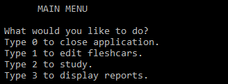
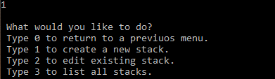
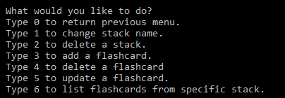
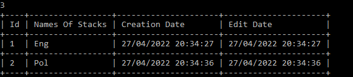
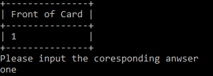
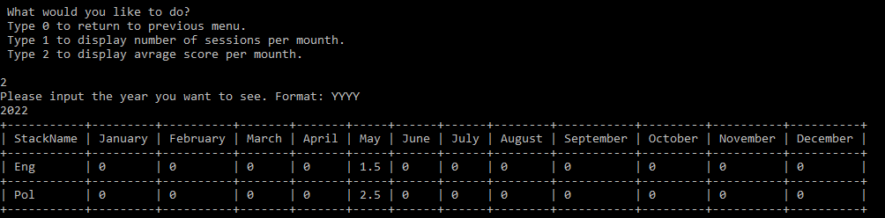

# Flashcards

Third console application in a series for learning .net. 

Application is meant for flashcard studying

## Requirements: 
 - [x] This is an application where the users will create Stacks of Flashcards.
 - [x] You'll need two different tables for stacks and flashcards. The tables should be linked by a foreign key.
 - [x] Stacks should have an unique name.
 - [x] Every flashcard needs to be part of a stack. If a stack is deleted, the same should happen with the flashcard.
 - [x] You should use DTOs to show the flashcards to the user without the Id of the stack it belongs to.
 - [x] When showing a stack to the user, the flashcard Ids should always start with 1 without gaps between them. If you have 10 cards and number 5 is deleted, the table should show Ids from 1 to 9.
 - [x] After creating the flashcards functionalities, create a "Study Session" area, where the users will study the stacks. All study sessions should be stored, with date and score.
 - [x] The study and stack tables should be linked. If a stack is deleted, it's study sessions should be deleted.
 - [x] The project should contain a call to the study table so the users can see all their study sessions. This table receives insert calls upon each study session, but there shouldn't be update and delete calls to it.

## Features
- SQL connection
  - The program uses a SQL connection to store and read information.
  - If database or table do not exist they will be crated on startup.

- Console main menu
  - 

- Edit flashcards
  - 
  - User can crate a new stack of cards
  - Edit existing stacks
  - 
  - List existing stacks
  - 

- Study
  - User has option to list all previus study session or start a new study session
  - 
  - Image shows english study session. Card shows 1 on one side and answer is one as written below 

- Display reports
  -

- Reporting is done for all the tables with different information, depending on request
  - 
  - "ConsoleTableExt" library was used for table display 

## Tech stack:
- Sql Server
- Sql data reader
- SQL
- .net 6.0

Special thanks to [Cappuccinocodes](https://github.com/cappuccinocodes) for help and advice.
